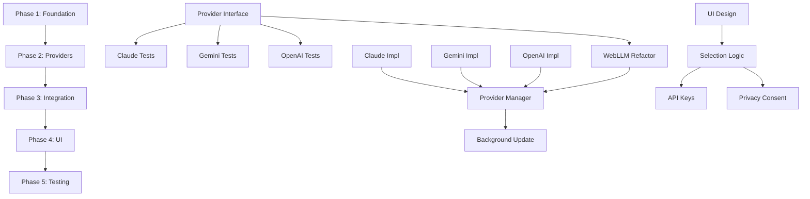

# Implementation Plan: Multi-API Provider Feature

## Timeline: 4-5 weeks

## Executive Summary
Implement support for external AI APIs (Claude, Gemini, OpenAI) while maintaining existing Local AI functionality. This plan follows TDD principles and maintains all quality gates.

---

## PHASE 1: Foundation (Week 1) - 12 hours

### Task 1.1: Constitutional Amendment
- **File:** `.specify/memory/constitution.md`
- **Action:** Update Principle I to allow optional external APIs with user consent
- **Estimate:** 2 hours
- **Dependencies:** None
- **Quality Gate:** Stakeholder approval
- **Implementation:**
  ```markdown
  ### I. Privacy-First Architecture with Optional External APIs
  The extension prioritizes local AI inference but supports optional external API usage with explicit user consent.
  ```

### Task 1.2: Create Provider Interface
- **File:** `src/inference/inference-provider.ts`
- **Action:** Define `InferenceProvider` interface
- **Estimate:** 2 hours
- **Dependencies:** None
- **Quality Gate:** TypeScript compiles
- **Implementation:**
  ```typescript
  export interface InferenceProvider {
    initialize(): Promise<void>;
    generateReply(systemPrompt: string, userPrompt: string): Promise<string>;
    validateApiKey(key: string): Promise<boolean>;
    isReady(): boolean;
    getProviderName(): string;
    getModelName(): string;
    dispose(): Promise<void>;
  }
  ```

### Task 1.3: Create Provider Registry
- **File:** `src/inference/provider-registry.ts`
- **Action:** Factory pattern for creating providers
- **Estimate:** 3 hours
- **Dependencies:** Task 1.2
- **Quality Gate:** Unit tests pass
- **Implementation:**
  ```typescript
  export class ProviderRegistry {
    static create(type: ProviderType, apiKey?: string): InferenceProvider
    static getAvailableProviders(): ProviderType[]
    static validateProviderType(type: string): boolean
  }
  ```

### Task 1.4: Update Manifest Permissions
- **File:** `src/manifest.json`
- **Action:** Add optional host permissions for API endpoints
- **Estimate:** 1 hour
- **Dependencies:** None
- **Quality Gate:** Manifest validates
- **Changes:**
  ```json
  {
    "optional_host_permissions": [
      "https://api.anthropic.com/*",
      "https://generativelanguage.googleapis.com/*",
      "https://api.openai.com/*"
    ]
  }
  ```

### Task 1.5: Setup Dependencies
- **Action:** Install SDK packages and types
- **Estimate:** 1 hour
- **Dependencies:** None
- **Quality Gate:** npm install succeeds, no vulnerabilities
- **Commands:**
  ```bash
  npm install @anthropic-ai/sdk@^0.24.0
  npm install @google/generative-ai@^0.21.0
  npm install openai@^4.56.0
  npm install --save-dev @types/node
  ```

### Task 1.6: Create Base Provider Tests
- **File:** `tests/inference/base-provider.spec.ts`
- **Action:** Write base test suite for all providers
- **Estimate:** 3 hours
- **Dependencies:** Task 1.2
- **Quality Gate:** Tests exist and fail (Red phase)

---

## PHASE 2: Provider Implementations (Week 2-3) - 25 hours

### Task 2.1: Write Tests for Claude Provider (TDD)
- **File:** `tests/providers/claude-provider.spec.ts`
- **Action:** Write comprehensive test suite
- **Estimate:** 3 hours
- **Dependencies:** Task 1.6
- **Quality Gate:** Tests fail (Red phase)
- **Test Cases:**
  - API key validation (valid/invalid)
  - Reply generation success
  - Error handling (network, rate limit)
  - Response format normalization
  - Token limit enforcement

### Task 2.2: Implement Claude Provider
- **File:** `src/inference/providers/claude-provider.ts`
- **Action:** Implement `InferenceProvider` for Claude API
- **Estimate:** 4 hours
- **Dependencies:** Task 2.1
- **Quality Gate:** All tests pass (Green phase)
- **Key Features:**
  - Use `claude-3-5-sonnet-20241022` model
  - Handle 429 rate limits gracefully
  - Normalize response format
  - Secure API key handling

### Task 2.3: Write Tests for Gemini Provider (TDD)
- **File:** `tests/providers/gemini-provider.spec.ts`
- **Action:** Write comprehensive test suite
- **Estimate:** 3 hours
- **Dependencies:** Task 1.6
- **Quality Gate:** Tests fail (Red phase)

### Task 2.4: Implement Gemini Provider
- **File:** `src/inference/providers/gemini-provider.ts`
- **Action:** Implement `InferenceProvider` for Gemini API
- **Estimate:** 4 hours
- **Dependencies:** Task 2.3
- **Quality Gate:** All tests pass (Green phase)
- **Key Features:**
  - Use `gemini-1.5-flash` model
  - Handle quota errors
  - Safety settings configuration

### Task 2.5: Write Tests for OpenAI Provider (TDD)
- **File:** `tests/providers/openai-provider.spec.ts`
- **Action:** Write comprehensive test suite
- **Estimate:** 3 hours
- **Dependencies:** Task 1.6
- **Quality Gate:** Tests fail (Red phase)

### Task 2.6: Implement OpenAI Provider
- **File:** `src/inference/providers/openai-provider.ts`
- **Action:** Implement `InferenceProvider` for OpenAI API
- **Estimate:** 4 hours
- **Dependencies:** Task 2.5
- **Quality Gate:** All tests pass (Green phase)
- **Key Features:**
  - Use `gpt-4o-mini` model
  - Handle rate limits
  - Stream response handling

### Task 2.7: Refactor WebLLM into Provider
- **File:** `src/inference/providers/webllm-provider.ts`
- **Action:** Extract existing WebLLM logic into provider pattern
- **Estimate:** 4 hours
- **Dependencies:** Task 1.2
- **Quality Gate:** Existing tests still pass, no regression
- **Key Changes:**
  - Wrap existing model loader
  - Implement provider interface
  - Maintain backward compatibility

---

## PHASE 3: Background Integration (Week 3) - 10 hours

### Task 3.1: Create Provider Manager
- **File:** `src/inference/provider-manager.ts`
- **Action:** Singleton to manage active provider
- **Estimate:** 3 hours
- **Dependencies:** All Phase 2 tasks
- **Quality Gate:** Unit tests pass
- **Features:**
  - Provider switching
  - State management
  - Error recovery

### Task 3.2: Update Background Service Worker
- **File:** `src/background.ts`
- **Action:** Integrate provider manager
- **Estimate:** 4 hours
- **Dependencies:** Task 3.1
- **Quality Gate:** Integration tests pass
- **Key Changes:**
  ```typescript
  // Replace direct WebLLM usage
  import { ProviderManager } from './inference/provider-manager';
  const manager = ProviderManager.getInstance();

  // In message handlers
  const provider = await manager.getActiveProvider();
  const reply = await provider.generateReply(systemPrompt, userPrompt);
  ```

### Task 3.3: Add New Message Handlers
- **File:** `src/background.ts`
- **Action:** Handle provider-specific messages
- **Estimate:** 3 hours
- **Dependencies:** Task 3.2
- **Quality Gate:** Message tests pass
- **New Handlers:**
  - `switchProvider`: Change active provider
  - `validateApiKey`: Test API key validity
  - `getProviderStatus`: Check provider health
  - `clearApiKey`: Remove stored key

---

## PHASE 4: UI Implementation (Week 4) - 18 hours

### Task 4.1: Design Provider Selection UI
- **File:** `popup.html`
- **Action:** Add provider selection interface
- **Estimate:** 4 hours
- **Dependencies:** None
- **Quality Gate:** UI renders correctly
- **Components:**
  - Provider radio button group
  - API key input section
  - Status indicators
  - Test button

### Task 4.2: Style Provider Components
- **File:** `popup.css`
- **Action:** Add styles for new UI elements
- **Estimate:** 3 hours
- **Dependencies:** Task 4.1
- **Quality Gate:** Visual review passes
- **Styles:**
  - Provider cards
  - Status indicators (green/yellow/red dots)
  - Privacy warning box
  - API key input styling

### Task 4.3: Implement Provider Selection Logic
- **File:** `src/popup.ts`
- **Action:** Handle provider switching
- **Estimate:** 4 hours
- **Dependencies:** Task 4.1
- **Quality Gate:** Provider switching works
- **Implementation:**
  ```typescript
  // Provider selection handler
  providerRadios.forEach(radio => {
    radio.addEventListener('change', async (e) => {
      const provider = (e.target as HTMLInputElement).value;
      await handleProviderSwitch(provider);
    });
  });
  ```

### Task 4.4: Implement API Key Management
- **File:** `src/popup.ts`
- **Action:** Save, load, and validate API keys
- **Estimate:** 4 hours
- **Dependencies:** Task 4.3
- **Quality Gate:** Keys persist and validate
- **Features:**
  - Secure storage in chrome.storage.sync
  - Show/hide password toggle
  - Test API key functionality
  - Clear key option

### Task 4.5: Add Privacy Consent Flow
- **File:** `src/popup.ts`
- **Action:** Show consent dialog for external APIs
- **Estimate:** 3 hours
- **Dependencies:** Task 4.3
- **Quality Gate:** Consent flow works correctly
- **Implementation:**
  - First-time warning dialog
  - Consent storage
  - Cancel option returns to local

---

## PHASE 5: Testing & Documentation (Week 5) - 15 hours

### Task 5.1: Integration Testing Suite
- **File:** `tests/integration/multi-provider.spec.ts`
- **Action:** End-to-end testing
- **Estimate:** 5 hours
- **Dependencies:** All previous phases
- **Quality Gate:** All integration tests pass
- **Test Scenarios:**
  - Provider switching flow
  - API key validation for each provider
  - Reply generation with each provider
  - Error recovery scenarios
  - Privacy consent flow

### Task 5.2: Manual Testing Protocol
- **Action:** Test in actual Chrome browser
- **Estimate:** 4 hours
- **Dependencies:** Task 5.1
- **Quality Gate:** Checklist complete
- **Checklist:**
  - [ ] Local AI works (no regression)
  - [ ] Claude API with valid key
  - [ ] Gemini API with valid key
  - [ ] OpenAI API with valid key
  - [ ] Invalid key handling
  - [ ] Network error handling
  - [ ] Privacy warning shows
  - [ ] LinkedIn integration works
  - [ ] Keys persist after restart

### Task 5.3: Update Documentation
- **Files:** `README.md`, `CLAUDE.md`, `docs/`
- **Action:** Document new features
- **Estimate:** 3 hours
- **Dependencies:** None
- **Quality Gate:** Documentation review
- **Updates:**
  - Setup instructions for each provider
  - API key acquisition guides
  - Troubleshooting section
  - Architecture diagrams

### Task 5.4: Run Full Quality Gates
- **Action:** Execute complete build pipeline
- **Estimate:** 2 hours
- **Dependencies:** All tasks
- **Quality Gate:** All checks pass
- **Commands:**
  ```bash
  npm run type-check  # 0 errors
  npm run lint        # 0 warnings
  npm test            # All pass
  npm run test:coverage  # >80%
  npm run build       # Succeeds
  npm run validate-manifest  # Valid
  ```

### Task 5.5: Create Release Package
- **Action:** Build and package extension
- **Estimate:** 1 hour
- **Dependencies:** Task 5.4
- **Quality Gate:** Package builds and installs
- **Steps:**
  1. Update version in manifest.json and package.json
  2. Run `npm run package`
  3. Test installation of .zip file
  4. Create release notes

---

## Dependencies Graph



---

## Risk Mitigation

| Risk | Probability | Impact | Mitigation |
|------|-------------|--------|------------|
| API SDK breaking changes | Medium | High | Lock SDK versions, test before updates |
| Different API response formats | High | Medium | Adapter pattern, comprehensive tests |
| API rate limits during testing | Medium | Low | Mock responses, test quotas |
| Constitutional rejection | Low | High | Get approval in Phase 1 |
| User confusion with options | Medium | Medium | Clear UI, helpful descriptions |
| API key security breach | Low | Very High | Never log keys, use secure storage |
| Provider service outages | Medium | Medium | Clear error messages, suggest alternatives |

---

## Rollback Plan

If critical issues arise post-deployment:

1. **Immediate:** Revert to previous version
   ```bash
   git checkout v1.x.x
   npm run build
   npm run package
   ```

2. **Hotfix:** If specific provider broken
   - Disable that provider in UI
   - Release patch version
   - Fix issue in next sprint

3. **Communication:**
   - Update Chrome Web Store listing
   - Post known issues in GitHub
   - Email affected users (if possible)

---

## Success Criteria

### Technical Success
- [ ] All quality gates pass
- [ ] Test coverage maintained >80%
- [ ] No regression in Local AI
- [ ] All three external providers functional
- [ ] Build size increase <500KB

### User Success
- [ ] Users can switch providers easily
- [ ] API key setup is straightforward
- [ ] Privacy warning is clear
- [ ] Error messages are helpful
- [ ] Performance acceptable (<2s response time)

### Business Success
- [ ] Feature ships on schedule
- [ ] No critical bugs in first week
- [ ] Positive user feedback
- [ ] No privacy complaints

---

## Timeline Summary

| Week | Phase | Hours | Deliverables |
|------|-------|-------|--------------|
| 1 | Foundation | 12h | Interface, Registry, Dependencies |
| 2-3 | Providers | 25h | All four provider implementations |
| 3 | Integration | 10h | Background service updated |
| 4 | UI | 18h | Complete UI for provider management |
| 5 | Testing & Release | 15h | Tested, documented, packaged |

**Total:** 80 hours over 5 weeks

---

## Next Steps

1. ✅ Get stakeholder approval for this plan
2. ✅ Create feature branch: `git checkout -b feature/multi-api-providers`
3. ✅ Start Phase 1, Task 1.1: Constitutional Amendment
4. ✅ Set up project board for task tracking
5. ✅ Schedule weekly progress reviews

---

**Plan Version:** 1.0.0
**Created:** 2025-10-13
**Status:** Ready for Approval
**Author:** ReplyMate Team
**Estimated Start:** Week of 2025-10-20
**Estimated Complete:** Week of 2025-11-24